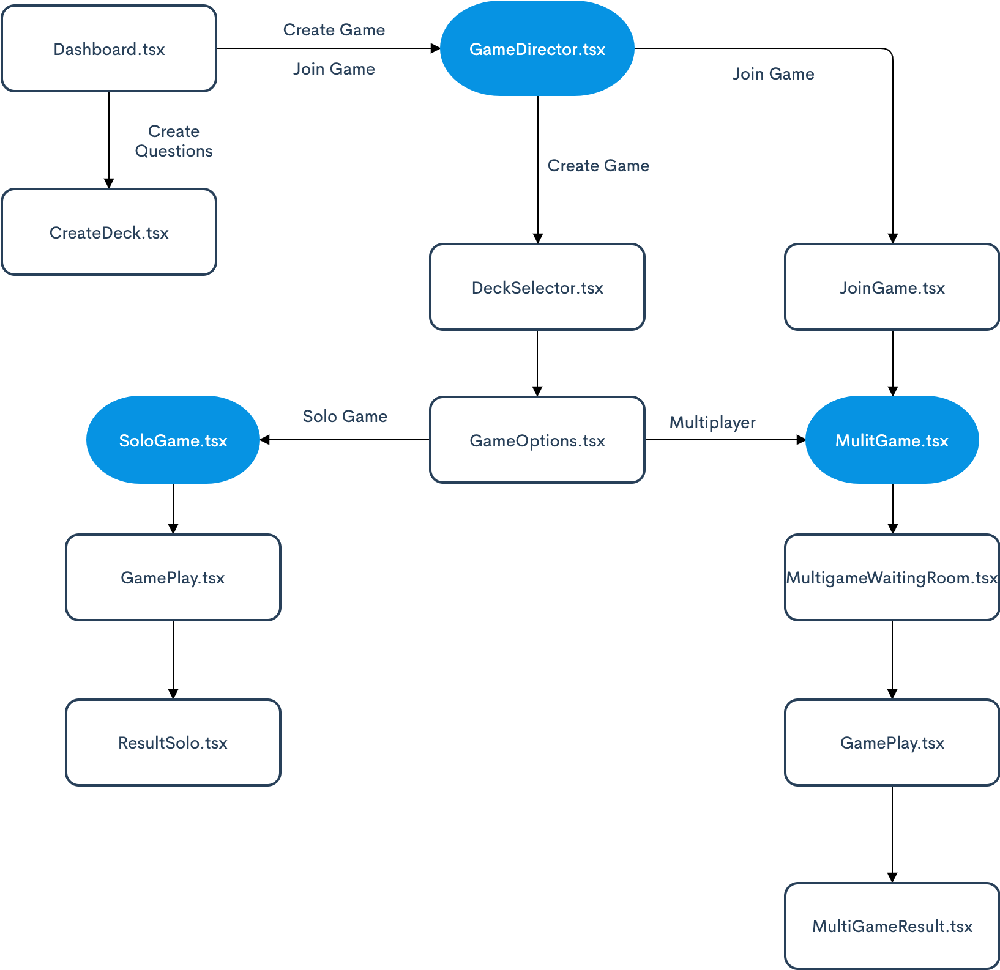
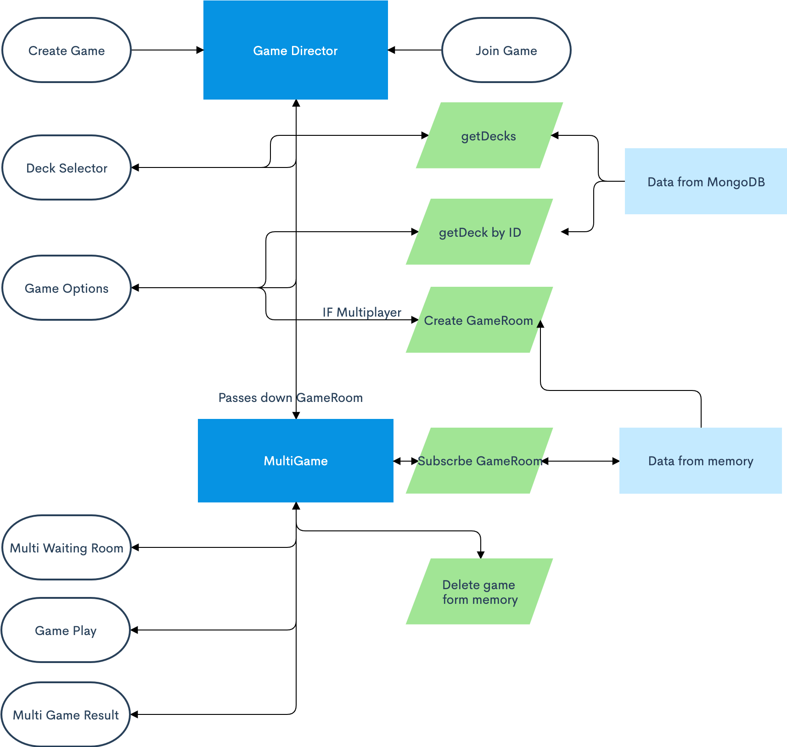

# TL;DR
Trend Wars is a game where you as a player can choose which word was trendiest in the chosen topic, territory, category. It can be played solo or with friends. The user also able to submit it's own question ideas, and after approval it is playable.

## Play it now: <https://trendwars.herokuapp.com/>

## Table of Contents:
<table>
<tr>
  <td rowspan="6"></td>
  <td><a href=#wireframes>Wireframes</a></td>
  
</tr>
<tr>
  <td><a href=#design>Design</a></td>
</tr>
  <tr>
  <td><a href=#game-flow-chart>Game Flow Chart</a></td>
</tr>
  <tr>
  <td><a href=#multiplayer-game-flow-chart>Multiplayer Game Flow Chart</a></td>
</tr>
  <tr>
  <td><a href=#code-documentation>Code Documentation</a></td>
</tr>
  <tr>
  <td><a href=#technologies>Technologies</a></td>
</tr>
</table>

## Wireframes
The wireframes not represent the final product and not all pages have wireframes. After finishing the initial coding I switched out Bootstrap and strated using my own design and did not made any new wireframes.
#### [See all the wireframes in PDF here](.github/initial-wireframes.pdf)

---
## Design
I designed the whole app - no wonder I'm not a designer - and implemented it with pure CSS. Some pages does not have design, since I just used the already established style to make it. 
#### [See all the designs in PDF here](.github/twdesign.pdf)

---

## Game Flow Chart
The game directed by the game director. It decides what component to mount/unmount. Sub directors are the sologame and multigame which can direct most of their own part of the gameplay. 

## Multiplayer Game Flow Chart
Blue squares represents the main controller components (Game Director and MultiGame) whom are responsible for the user's flow thru the game. Green ones are connections to the GraphQL server in the back. White colored nodes represent what the user sees.

## Code Documentation

### Special words
**Deck** - Represents the data that makes up a game's basis - name, description, keywords etc. - that anyone can submit in the Create Questions segment.

**GameRoom** - Represents the data that is "passed around" in multiplayer, contains everything that a multi gama needs

**Waiting Room** - The component where the player join to before starting the game

### Main Components

### Technologies
Whatever I used 
