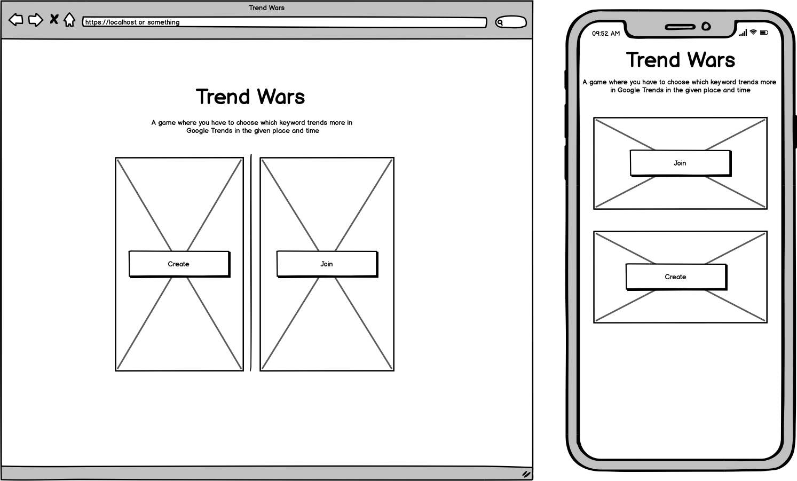
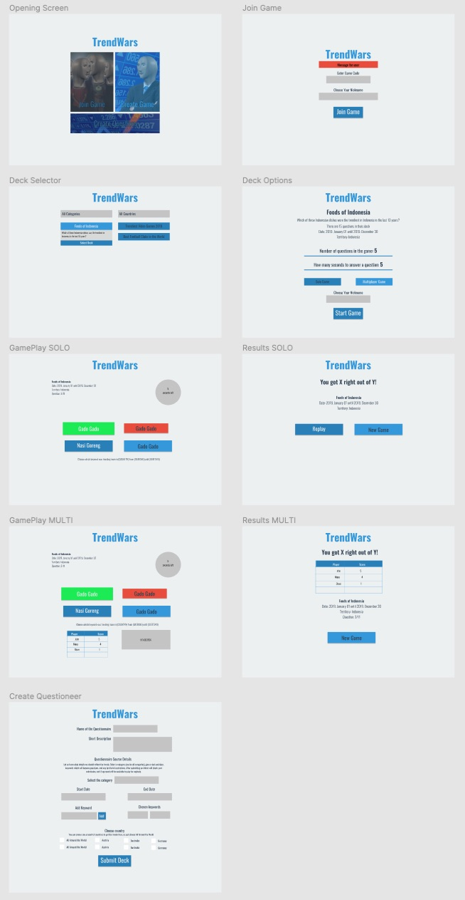

## TL;DR
Trend Wars is a game where you as a player can choose which word was trendiest in the chosen topic, territory, category. It can be played solo or with friends. The user also able to submit it's own question ideas, and after approval it is playable.

### Play it now: <https://trendwars.herokuapp.com/>

## Table of Contents:
<table>
<tr>
  <td rowspan="5"></td>
  <td><a href=#wireframes>Wireframes</a></td>
  
</tr>
<tr>
  <td><a href=#design>Design</a></td>
</tr>
  <tr>
  <td><a href=#wireframes>Wireframes</a></td>
</tr>
  <tr>
  <td><a href=#wireframes>Wireframes</a></td>
</tr>
  <tr>
  <td><a href=#Technologies>Technologies</a></td>
</tr>
</table>

### Wireframes
The wireframes not represent the final product and not all pages have wireframes. After finishing the initial coding I switched out Bootstrap and strated using my own design and did not made any new wireframes.
#### [See all the wireframes in PDF here](.github/initial-wireframes.pdf)

---
### Design
I designed the whole app - no wonder I'm not a designer - and implemented it with pure CSS. Some pages does not have design, since I just used the already established style to make it. 
#### [See all the designs in PDF here](.github/twdesign.pdf)

---

### Game Flow Chart

### Code Documentation
SRC folder content one-by-one 
What is a deck?

### Technologies
Whatever I used 
